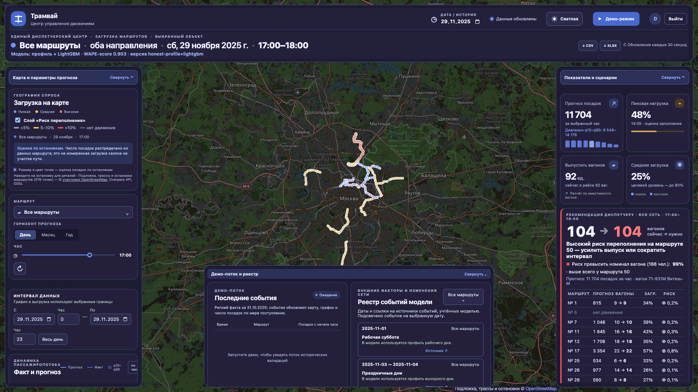
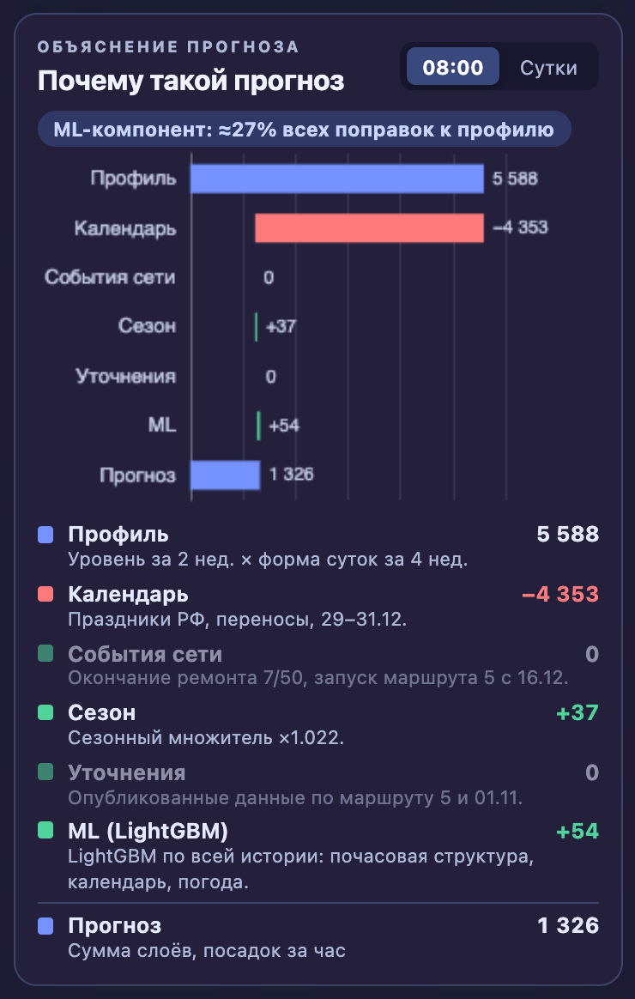
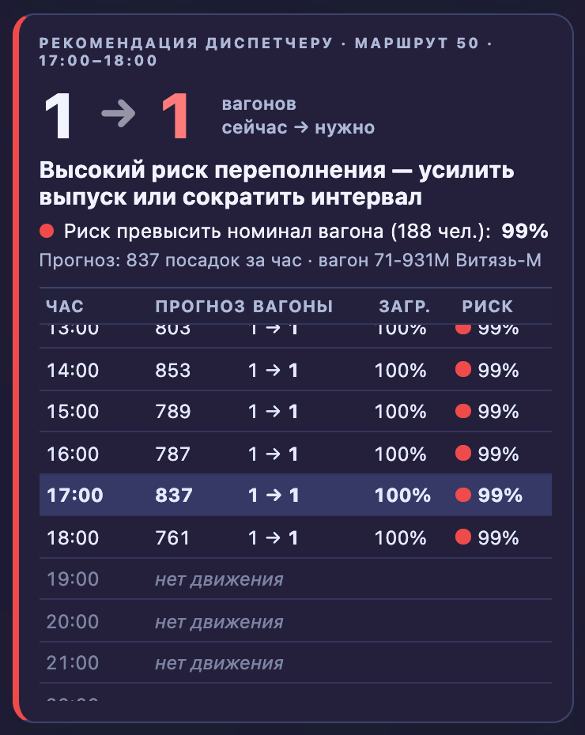

# ИИ-прогноз загрузки трамвайных маршрутов

Хакатон Московского транспорта 2026 · трек «ИИ-прогноз загрузки трамвайных маршрутов».

Прогноз пассажиропотока (посадок) трамваев Москвы по связке **маршрут × час** на горизонтах **день / месяц / год**. Веб-сервис с картой, рекомендациями диспетчеру (выпуск вагонов и время стоянки), прогнозом, который уточняется в течение дня по потоку валидаций, и выгрузкой CSV/XLSX.

| Результат | Значение |
|---|---|
| **WAPE-score на скрытом эталоне (ноябрь–декабрь 2025), релиз HONEST2** | **0.90257** (профиль + LightGBM; без фактов посадок целевого периода; числовые параметры — из истории, кроме рецепта ансамбля E7 (выбран по загрузкам E1–E7, подтверждён прокси); погода — фактическая как внешний фактор; порог максимального балла — 0.88; baseline — 0.48) |
| Строгий вариант HONEST4: погода = климатическая норма 2015–2024 | 0.90066 — без фактической погоды (даты событий 15.11 и 26.12 остаются) |
| Лучший экспериментальный (с подбором по LB и данными задним числом) | 0.90017 (E7) — **не релиз**, см. [docs/MODEL.md §3](docs/MODEL.md) |
| Вклад ML-компонента (LightGBM) на скрытом эталоне | **+0.006** (0.89329 → 0.89939 / 0.90017, на базе S31); на честной базе — прокси +0.006; на истории лучше профиля в среднем по 5 срезам (E7 — в 3 из 5) |
| Локальная оценка без лидерборда | 5 временных срезов без утечек; ранжирует загруженные варианты как лидерборд — **Spearman 0.95** |
| Вклад внешних данных на скрытом эталоне | календарь **+0.0325**, окончание ремонта путей **+0.0053**, запуск маршрута 5 **+0.0037** |
| Потоковый режим (`ml/stream.py`) | прогноз на сутки вперёд — WAPE-score 0.9054 против 0.8907 у бейзлайна «тот же день неделю назад» (реплей 01.09–31.10.2025, 61 день; на неделю вперёд — 0.9060); обучение профиля 3 мс, LightGBM 9 с, инференс на сутки 5 мс |
| Горизонт «год» (официальная статистика data.mos.ru) | out-of-sample 2026: MAPE **5.5%** против 9.4% у наивного |
| Уточнение прогноза в течение дня (nowcast) | точность остатка дня 0.880 → **0.907** (с 15:00) |
| Воспроизводимость | `ml/run_pipeline.py` собирает релиз `FINAL.csv` (= HONEST2) от сырых данных; тесты `ml/tests` |

📄 **Технический отчёт для экспертов:** [docs/REPORT.html](docs/REPORT.html) (открывается в браузере, графики встроены) · [docs/REPORT.pdf](docs/REPORT.pdf)

---

## Быстрый старт для жюри

### 1. Веб-сервис (Docker Compose)
```powershell
git clone <ссылка на этот репозиторий>
cd <папка репозитория>
docker compose up --build
```
- UI: http://localhost:3000
- API: http://localhost:8080/api/v1 (OpenAPI — `docs/contracts/openapi.yaml`)

> **Вход для жюри: `dispatcher` / `tram2025`**
>
> Весь `/api/**` закрыт HTTP Basic, открыт только `/api/v1/health`. Пример: `curl -u dispatcher:tram2025 http://localhost:8080/api/v1/routes`. Логин и пароль задаются переменными `APP_USER` / `APP_PASSWORD`; межсервисный токен backend → сервис данных — `INTERNAL_TOKEN` (сервис данных без него отвечает 401 и наружу не публикуется).

- Готовые прогнозы лежат в `artifacts/forecast/`; исходный датасет для запуска сервиса не нужен.
- Остановить: `docker compose down`.
- Карта загружается из OpenStreetMap без API-ключа; атрибуция источника отображается под картой.

Нагрузочный сценарий после старта: `k6 run scripts/load-test.js` (запросы идут с HTTP Basic, логин/пароль — `APP_USER` / `APP_PASSWORD`, по умолчанию `dispatcher` / `tram2025`). Замеры и методика — в разделе «Производительность».

### 2. ML-пайплайн (воспроизведение прогноза)
Нужны [uv](https://docs.astral.sh/uv/getting-started/installation/) (сам поставит Python 3.12 и закреплённые версии библиотек из `ml/requirements.txt`) и распакованный `dataset.zip` в папке `dataset/` в корне репозитория ([Я.Диск](https://disk.yandex.ru/d/DiFwlfMOauxjBg)): `dataset/train.csv`, `dataset/test.csv`, `dataset/labels/`, `dataset/spravochniki/`.

Одна и та же команда для Windows (PowerShell), Linux и macOS:
```bash
uv run --python 3.12 --with-requirements ml/requirements.txt python ml/run_pipeline.py
```
На Linux/macOS то же самое: `./ml/run_pipeline.sh`.

Шаги: сырые CSV (10 ГБ) → Parquet → target + сверка с `labels` → внешние данные → бэктест → релиз `ml/submissions/FINAL.csv` → артефакты сервиса `artifacts/forecast/` → рекомендации → реестр аномалий. Внешние данные (погода Open-Meteo, календарь isdayoff, OSM) уже лежат в `data/external/` и `artifacts/geo/`, поэтому сеть не нужна и результат не зависит от доступности API; скачать заново — `fetch_*.py --refresh`.

- Время: 1 мин 12 с на MacBook M4 Pro с нуля (из них 41 с — конвертация 10 ГБ CSV; повторный запуск её пропускает).
- Память: пик ≈ 3.1 ГБ на конвертации CSV (DuckDB ограничен 3 ГБ, остальное сбрасывает на диск в `data/interim/`); обучение и релиз (`honest.py`) — ≈ 0.3 ГБ, рекомендации — 0.2 ГБ. Хватит ноутбука с 8 ГБ ОЗУ и ~15 ГБ свободного диска.
- Проверка на чистом клоне (macOS, arm64): `FINAL.csv` совпадает побайтно с загруженным релизом (md5 `5539230b9eff7d87f775a35bdaf02fe6`). На другой ОС/процессоре LightGBM может дать отличия в последнем знаке отдельных ячеек — WAPE-score совпадает до 4-го знака.
- Linux: LightGBM требует системную `libgomp1` (в Ubuntu/Debian есть по умолчанию; в минимальных образах — `apt-get install libgomp1`).

Проверки:
```bash
uv run --python 3.12 --with-requirements ml/requirements.txt --with pytest pytest ml/tests -q
```

---

## Модель

Релиз — **честная версия HONEST2** (`ml/honest.py`): ни одного факта посадок целевого периода; все числовые параметры выведены из истории, кроме рецепта ансамбля E7 — он выбран по загрузкам E1–E7 и подтверждён локальным прокси. Знание будущего раскрыто: фактическая погода, дата 15.11 (окончание ремонта), пост 26.12 (бесплатный проезд).

```
ŷ = 0.5 · Профиль + 0.25 · LightGBM, перемасштабированный к профилю (маршрут × месяц × выходной) + 0.25 · LightGBM
Профиль = Уровень(маршрут, тип дня) × Форма суток(маршрут, тип дня, час) × Сезон × Особые дни × События сети
```

- **Профиль** отвечает за *свежий уровень* спроса и изменения сети: уровень — медиана дневных сумм за 2 недели, форма суток — медиана часовых долей за 4 недели, 5 типов дней; календарь РФ; сезон ×1.03 — из систематического занижения бэктестов; 29–31.12 ×0.85 — априори. События сети — из объявлений Дептранса: ремонт путей 7/50 по выходным — обычный режим с 15.11 ([t.me/DtOperativno/23565](https://t.me/DtOperativno/23565)); запуск маршрута 5 с 16.12 на 7 вагонах (mos.ru). Уровень маршрута 5 — по аналогу маршрута 25: посадок на вагон × 7 вагонов.
- **LightGBM** (objective L1 ≡ WAPE, 600 деревьев) обучен на всей истории января–октября: маршрут, час, день недели, тип дня, праздник, температура, осадки, снег. Он отвечает за *почасовую структуру, календарные и погодные эффекты*, которые профиль за 4 недели видит плохо.
- **Почему ансамбль, а не одна модель:** бустинг в одиночку выучивает среднегодовой уровень и нестабилен между сезонами; профиль ловит свежий уровень, но шумит в структуре. На истории ансамбль лучше профиля во **всех 5 фолдах** (0.8554–0.8581 против 0.8505; октябрь 0.9074 против 0.9023), на скрытом эталоне **+0.006**. Вес ансамбля: рецепт E7 выбран по серии загрузок E1–E7 на лидерборд (лучший из семи); локальный прокси, построенный позже, выбор подтвердил: по среднему 5 срезов E7 и E6 в пределах шума (0.8582 / 0.8583), на октябрьском срезе E7 лучший (0.9074).
- **Прямой многошаговый прогноз** на 61 день без рекурсии — ошибка не накапливается.
- **«Почему такой прогноз»:** `artifacts/forecast/components.parquet` раскладывает каждое значение на слои (профиль → календарь → события сети → сезон → уточнения → ML).
- **Интервалы q10/q90** — эмпирические квантили ошибок по 38 неделям скользящего бэктеста; **риск переполнения** — вероятность превысить номинал вагона.

Реализация: `ml/core.py` (профиль), `ml/ensemble.py` (LightGBM), `ml/honest.py` (релиз `FINAL.csv` = `HONEST2.csv`), `ml/stream.py` (потоковый режим), `ml/year_horizon.py` (горизонт «год»). Все эксперименты — [docs/EXPERIMENTS.md](docs/EXPERIMENTS.md).

### Академическая честность

Всё, что использовало подбор по лидерборду (сезон ×1.022 по параболе, маршрут 5 ×1.6/×1.5, 29–31.12 и конец декабря маршрута 5) или данные целевого периода (факт 01.11 00–02 ч из хвоста `test.csv`, опубликованный поток маршрута 5), — **эксперименты** (кроме рецепта ансамбля E7, взятого в релиз и раскрытого выше), открыто перечисленные в [docs/MODEL.md §3](docs/MODEL.md) и [docs/EXPERIMENTS.md](docs/EXPERIMENTS.md). Лучший из них — E7 (0.90017) — не релиз. Абляции источников (календарь, окончание ремонта, маршрут 5) остаются доказательством эффекта внешних данных: это измерения, а не подгонка.

### Потоковый режим

`ml/stream.py` принимает валидации по дням и на каждом новом дне переобучает ансамбль профиль + LightGBM (календарь и праздники учтены; реестр событий сети, сезонный множитель и маршрут 5 — только в релизе `honest.py`) только на данных до текущей даты:

```bash
uv run --python 3.12 --with-requirements ml/requirements.txt python ml/stream.py forecast --asof 2025-10-31 --horizon 61 --out stream_forecast.csv   # прогноз от даты на горизонт (дней)
uv run --python 3.12 --with-requirements ml/requirements.txt python ml/stream.py replay --start 2025-09-01 --end 2025-10-31   # реплей день за днём без утечек (~2 мин)
```

Результаты реплея (`ml/research/stream_replay.json`): прогноз на сутки вперёд — WAPE-score 0.9054 против 0.8907 у бейзлайна «тот же день неделю назад» (реплей 01.09–31.10.2025, 61 день; на неделю вперёд — 0.9060); обучение профиля 3 мс, LightGBM 9 с, инференс на сутки 5 мс. Подробно — [docs/MODEL.md §7](docs/MODEL.md).

### Выбор модели ML

Релизный прогноз — **ансамбль профиля и LightGBM** (HONEST, выше). Ниже — сравнение с нейросетями; сравнение с CatBoost/LightGBM и гибридами — в [docs/EXPERIMENTS.md](docs/EXPERIMENTS.md) (R15–R18). Для сравнения проверены LSTM, N-HiTS и TiDE: каждая сеть прогнозировала суточный спрос на 61 день, а общий профиль распределял его по часам.

| Модель | Средний почасовой WAPE-score на 3 временных срезах |
|---|---:|
| **Профиль + LightGBM (релиз, рецепт E7)** | **0.8370** |
| Профиль (основа релиза) | 0.8254 |
| N-HiTS | 0.8104 |
| LSTM | 0.7977 |
| TiDE | 0.7881 |
| Профиль + N-HiTS, 50/50 | 0.8243 |

Срезы: обучение до 30.04, 30.06 и 31.08.2025, затем прогноз на следующие 61 сутки. Будущие признаки ограничены известным календарём; маршрут 5 без истории в эксперимент не входит. Нейросети сравнивались на компактных конфигурациях и одном seed. Полная методика, результаты по каждому срезу и замеры скорости — в [отчёте](docs/NEURAL_COMPARISON.md). Скрытый score 0.90257 относится к релизу HONEST.

Воспроизвести выбор модели из корня репозитория после распаковки `dataset.zip` в `dataset/` (достаточно `dataset/labels/` и `data/external/calendar_ru_2025.csv`):

```bash
uv run --python 3.12 --with-requirements ml/research/requirements-neural.txt python ml/research/neural_comparison.py --steps 1000
```

Команда сохраняет таблицу исходных чисел в `ml/research/neural_comparison.json`. Релизный прогноз: `uv run --python 3.12 --with-requirements ml/requirements.txt python ml/honest.py` → `ml/submissions/HONEST2.csv` и `FINAL.csv` (одинаковые).


---

## Обязательные артефакты

| # | Артефакт | Где |
|---|---|---|
| 1 | ML-модель, код обучения и инференса, инструкция запуска | [`ml/`](ml), [`ml/run_pipeline.py`](ml/run_pipeline.py), [docs/MODEL.md](docs/MODEL.md) |
| 2 | Все внешние данные со ссылками | [`data/external/`](data/external), [SOURCES.md](data/external/SOURCES.md) |
| 3 | Запускаемый веб-сервис, точки входа API, инструкция | `docker-compose.yml`, раздел «Быстрый старт», [docs/ARCHITECTURE.md §2](docs/ARCHITECTURE.md) |
| 4 | Схема архитектуры и модулей; область применимости; зависимости от внешних данных | [docs/ARCHITECTURE.md](docs/ARCHITECTURE.md), [docs/MODEL.md §5–6](docs/MODEL.md) |
| 5 | Производительность и дополнительные возможности | разделы ниже |
| 6 | Ограничения и план развития | [docs/MODEL.md §7–8](docs/MODEL.md), раздел ниже |

---

## Внешние данные

**Внешние источники с подтверждённым эффектом** (ссылки и скрипты загрузки — [data/external/SOURCES.md](data/external/SOURCES.md)):

| # | Источник | Категория | Ссылка | Где используется | Подтверждённый эффект |
|---|---|---|---|---|---|
| 1 | Производственный календарь РФ | календарь | https://isdayoff.ru/ | итоговая модель | **+0.0325** WAPE-score на скрытом эталоне (абляция S8) |
| 2 | Погода, почасово (ERA5) | погода | https://open-meteo.com/en/docs/historical-weather-api | горизонт «день» (`weather_factor`), nowcast, ползунок | без утечек: в дождь смещение прогноза **+10.9% → −1.5%** |
| 3 | Ремонт путей по выходным, маршруты 7/50 | прочие: ремонты | [newsvostok.ru](https://newsvostok.ru/dlya-tramvaev-7-i-50-izmeneniya-po-vyhodnym-budut-dejstvovat-do-kontsa-oseni/) | итоговая модель, реестр событий | **+0.0053** (абляция S7) |
| 4 | Запуск маршрута 5 (16.12.2025, 7 вагонов) | прочие: новые маршруты | [mos.ru](https://www.mos.ru/mayor/themes/13888050/), справочник GTFS | итоговая модель, реестр событий; уровень — по аналогу маршрута 25 | **+0.0037** (абляция S6) |
| 5 | Дептранс «Оперативно»: окончание ремонта 7/50 (с 15.11), вечерние укорочения 7/50, перенос остановок 7/11/12/50 с 20.12, бесплатный проезд 31.12 с 20:00 | прочие: события сети | [t.me/DtOperativno](https://t.me/DtOperativno/23565) | дата окончания ремонта — в HONEST; остальное — реестр событий | тот же эффект, что у источника 3 (+0.0053), отдельно не считаем |
| 6 | Месячный пассажиропоток трамваев Москвы (набор 62521) | прочие: официальная статистика | [data.mos.ru/opendata/62521](https://data.mos.ru/opendata/62521) | проверка уровня прогноза (доля наших маршрутов ≈31%); горизонт «год» | «год»: MAPE 2026 **5.5%** против 9.4% у наивного |

Дополнительно: **OpenStreetMap** (https://www.openstreetmap.org, Overpass API) — трассы и 576 остановок всех 10 маршрутов для карты и геопривязки (справочник организаторов покрывает только 5 маршрутов). Проверено и не подтверждено: дни пробок ≥ 9 баллов (эффект 0.0000 на LB), школьные каникулы (±1%). Проверены и не подходят наборы data.mos.ru 758/62904 (автобусы), 62101 (ремонт асфальта — в ноябре–декабре 2025 работ нет), 2527 (перекрытия 2026), 60665/60666 (расписание 2026).

**Пайплайн приёма и агрегация целевой величины:** `ml/ingest/build_target.py` строит target из 62 млн сырых валидаций и сверяет с разметкой организаторов — **совпадение в 57 550 из 57 551 ячеек**, суммарно 59 667 192 против 59 667 191 посадки.

---

## Архитектура

Приём и нормализация → признаки и геопривязка → прогноз и агрегация → REST API → frontend. Схема, контракты и решения для производительности — [docs/ARCHITECTURE.md](docs/ARCHITECTURE.md).

| Слой | Технологии |
|---|---|
| ML-контур | Python 3.12, DuckDB, pandas, Parquet; NeuralForecast и PyTorch для сравнения архитектур |
| Выбранная модель прогноза | HONEST: профиль уровня и почасовой формы с календарём и событиями сети + LightGBM; потоковый режим `ml/stream.py`; LSTM, N-HiTS и TiDE проверены в walk-forward бэктесте |
| Backend | Java 21, Spring Boot 4.1, WebFlux / Netty; Python 3.12, FastAPI, Polars для чтения артефактов |
| Frontend | React 19, TypeScript 5, Leaflet + OpenStreetMap |
| Инфраструктура | Docker, Docker Compose |

---

## Производительность

Нагрузочный профиль `scripts/load-test.js` повторяет обновление экрана диспетчера: каждая итерация параллельно вызывает дневной и месячный прогноз, снимок карты, экспорт XLSX, разложение прогноза («почему такой прогноз») и риск переполнения — шесть HTTP-запросов, все с HTTP Basic. Для каждого endpoint заданы пороги p95 < 300 мс, ошибок < 1%, успешных проверок > 99% и ноль пропущенных итераций.

### Замеры 27.09.2026 — целевой профиль 2 vCPU / ~2 ГБ, с авторизацией (итоговая версия)

Лимиты — `docker-compose.perf.yml`: сервис данных 0,6 CPU / 640 МиБ, backend 1,0 CPU / 1 ГиБ, nginx 0,4 CPU / 256 МиБ. k6 в Docker, через nginx, шесть запросов на итерацию, разгон 90 с, плато 2 мин. `RANDOMIZE=1` — маршрут, дата и час случайные в каждой итерации (кэш почти не помогает), без него — один и тот же экран диспетчера.

| Цель на плато | URL | Запросов | p95 день | p95 месяц | p95 карта | p95 XLSX | p95 «почему» | p95 риск | Итог |
|---:|---|---:|---:|---:|---:|---:|---:|---:|---|
| 300 HTTP RPS | одинаковые | 55 794 | 7 мс | 7 мс | 8 мс | 7 мс | 7 мс | 7 мс | **Пройдено**: 0 ошибок, 0 пропусков |
| 300 HTTP RPS | случайные | 55 800 | 11 мс | 4 мс | 8 мс | 4 мс | 7 мс | 6 мс | **Пройдено**: 0 ошибок, 0 пропусков |
| 600 HTTP RPS | случайные | 95 382 | 2,9 с | 1,7 с | 3,1 с | 1,7 с | 3,0 с | 2,8 с | Не пройдено: 4,9% ошибок — предел профиля |

**Подтверждено: 300 HTTP RPS при p95 ≤ 12 мс на 2 vCPU** (требование — сотни RPS при p95 < 200–300 мс). Предел — между 300 и 600 RPS: на 600 RPS насыщаются сервис данных (промахи кэша) и nginx. На 4 vCPU (верхняя граница требования) запас больше.

Что дало ускорение (до оптимизации на 2 vCPU: 200 RPS проходили, 300 — p95 ≈ 0,4 с):
- **Кэш ответов в сервисе данных.** Прогнозы предрасчитаны, ответ зависит только от URL → LRU по URL (64 МБ на воркер). Сбрасывается при добавлении/удалении события диспетчера; события общие для воркеров через файл, его mtime — версия кэша.
- **Чистый ASGI-middleware** (проверка токена + кэш) вместо `BaseHTTPMiddleware`, `orjson`, 2 воркера uvicorn, без access-лога.
- **Проверка Basic без bcrypt** в backend (стандартный поток Spring тратил ~55 мс на запрос).
- **Перераспределение CPU**: backend на WebFlux при 0,4 CPU троттлился — теперь 1,0; сервису данных с кэшем хватает 0,6.

```bash
docker compose -f docker-compose.yml -f docker-compose.perf.yml up -d --build
docker run --rm --network msk_trans_default -v "$PWD/scripts:/scripts:ro" \
  -e BASE_URL=http://frontend:80 -e TARGET_ITERATIONS_PER_SECOND=50 -e RANDOMIZE=1 -e SOAK_MINUTES=2 \
  grafana/k6 run /scripts/load-test.js   # 50 итераций × 6 = 300 HTTP RPS
```

### Замеры 27.09.2026 — без лимитов, с авторизацией

Рабочий стек `docker compose up --build` без лимитов контейнеров, Docker Desktop на macOS (Docker выделено 8 vCPU / 16 ГБ). Нагрузка — образ `grafana/k6` в той же Docker-сети, через nginx фронтенда (`http://frontend:80`), то есть тем же путём, что и браузер. Разгон 90 с, плато 2 мин, спад 30 с.

| Цель на плато | Запросов за прогон | Средняя частота за прогон* | p95 день | p95 месяц | p95 карта | p95 XLSX | p95 «почему» | p95 риск | Ошибки |
|---:|---:|---:|---:|---:|---:|---:|---:|---:|---|
| 150 HTTP RPS | 27 984 | 116,6 RPS | 18 мс | 15 мс | 13 мс | 16 мс | 12 мс | 11 мс | 0%, пропущенных итераций нет |
| 300 HTTP RPS | 55 794 | 232,6 RPS | 16 мс | 14 мс | 11 мс | 15 мс | 11 мс | 9 мс | 0%, пропущенных итераций нет |

\* включает разгон и спад; на плато держалась целевая частота.

На 300 RPS: сервис данных — средний CPU 112%, пик 161% (Docker считает относительно одного ядра), 409 МиБ; backend — 20% / 32%, 389 МиБ; nginx — 8% / 31%, 14 МиБ. Узкое место по-прежнему сервис данных на Python/Polars.

Одиночные запросы (медиана из 10, стек без нагрузки): все эндпоинты `/api/v1/*` укладываются в 4–16 мс, самый тяжёлый — снимок карты и годовой прогноз (~15 мс).

Прогон 27.09 подтверждает, что авторизация не добавляет заметной задержки: проверка Basic — сравнение в постоянное время без bcrypt (стандартный поток Spring Security перекодировал пароль в bcrypt и тратил ~55 мс на каждый запрос — исправлено).

## Функциональность

- [x] Прогноз: день (по часам), месяц (по дням), год (в сервисе — год к году по дням; отдельная модель по месячной статистике data.mos.ru с MAPE 2026 5.5% — `ml/year_horizon.py`, в UI пока не подключена)
- [x] Интервалы неопределённости q10/q90
- [x] Рекомендации диспетчеру: выпуск вагонов (без роста парка) и доп. стоянка
- [x] Nowcast: уточнение остатка дня по факту
- [x] Агрегация по маршруту, остановке, участку и интервалу через API
- [x] Карта Москвы с динамикой по часам
- [x] Ползунки корректирующих коэффициентов (погода, событие, сезон, пробки)
- [x] Реестр событий сети в UI; диспетчер добавляет своё событие (ремонт, запуск, мероприятие, эффект в %) — прогноз, карта и рекомендации пересчитываются
- [x] Выгрузка CSV / XLSX (в том числе весь период по всем маршрутам)
- [x] Вход по логину и паролю (HTTP Basic, экран входа, кнопка «Выйти»); межсервисный токен backend → сервис данных
- [x] Тёмная тема по умолчанию, раскладка под 1920×1080 и 1440×900
- [x] Всегда видимый контекст объекта: маршрут · направление/остановка · дата · час; версия модели и WAPE-score в шапке
- [x] «Почему такой прогноз»: водопад профиль → календарь → события сети → сезон → уточнения → ML (LightGBM)
- [x] Рекомендация диспетчеру как главный элемент управления: «вагонов сейчас → нужно», риск превысить номинал вагона
- [x] Слой карты «Риск переполнения» (серый < 5%, жёлтый 5–10%, красный > 10%)
- [x] План/факт по прошедшим дням: полоса q10–q90, точки выхода факта за интервал, покрытие и WAPE-score за период
- [x] Провалы данных и причины (ремонты, праздники, изменения трасс, сбои) — таблица и затенение на графике¹
- [x] Часы без движения показываются как «нет движения», а не как ноль
- [x] Понятные ошибки API на русском: 400 (параметры, неизвестный маршрут), 401 (вход)
- [x] Трассы и 576 остановок из OpenStreetMap, источник подписан на карте

¹ Реестр аномалий — `artifacts/forecast/anomalies.json`: 23 события 2025 года (праздники, ремонты, изменения трасс, сбой данных) с эффектом, посчитанным по данным, и ссылками на источники.

| Карта, риск переполнения и рекомендации | «Почему такой прогноз» | Рекомендация диспетчеру |
|---|---|---|
|  |  |  |

---

## Ограничения и план развития

**Ограничения:** валидации — это входы, а не наполняемость; остановочный уровень — эвристика (в валидациях нет остановки); сезонный множитель без истории прошлых лет — один скаляр ×1.03 из бэктестов; маршрут 5 — оценка по аналогу; рекомендации не учитывают привязку маршрутов к депо. Подробно — [docs/MODEL.md §7](docs/MODEL.md).

**План развития:** 2+ года истории для годовой сезонности; GPS-телематика для остановок и наполняемости по участкам; автоматический сбор событий сети (Дептранс «Оперативно», mos.ru, transport.mos.ru); прогноз погоды для горизонта «день»; поток валидаций через Kafka для nowcast в проде.

---

<details><summary>Для команды</summary>

- Стратегия: [docs/RESEARCH.md](docs/RESEARCH.md), [docs/ML_PLAN.md](docs/ML_PLAN.md), [docs/KILLER_FEATURES.md](docs/KILLER_FEATURES.md)
- Данные: [docs/DATA.md](docs/DATA.md); контракты: [docs/contracts/README.md](docs/contracts/README.md)
</details>
