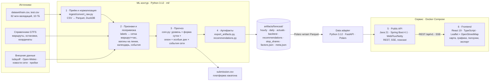

# Архитектура решения

## 1. Модули и поток данных

Разделение соответствует критерию 3: **приём/нормализация → признаки/геопривязка → ML-прогноз/агрегация → API → frontend**.

| # | Модуль | Где | Вход → выход | Технологии |
|---|---|---|---|---|
| 1 | Приём и нормализация | `ml/ingest/convert_raw.py` | 10 ГБ CSV → `data/interim/*.parquet` (~1 мин, zstd). Типизация, `tran_date_time` как единственный timestamp, фильтр `validation_result = 1` | DuckDB, Parquet |
| 2 | Признаки и геопривязка | `ml/core.py` (`load_labels`), `ml/export_artifacts.py`, `ml/external/*` | сетка маршрут × дата × час с нулями, тип дня, вагоны на линии (уникальные `garage_number` за час), календарь, погода, реестр событий сети; остановки и координаты из GTFS-справочника | pandas, DuckDB |
| 3 | Прогноз и агрегация | `ml/core.py`, `ml/config/events.py` | `ŷ = Level × Shape × Season × Special × Net`; горизонты: день (по часам), месяц (по дням), год (качественно) | pandas, numpy |
| 3а | Релиз и потоковый режим | `ml/honest.py`, `ml/stream.py`, `ml/ensemble.py` | релиз HONEST2: 0.5 · профиль + 0.5 · LightGBM (рецепт E7), без фактов посадок целевого периода → `ml/submissions/FINAL.csv`; `ml/stream.py` — ежедневное переобучение и прогноз от любой даты (`forecast --asof … --horizon …`, `replay …`) | pandas, LightGBM |
| 4 | Артефакты | `ml/export_artifacts.py`, `ml/recommendations.py` | Parquet и JSON по **контракту №1** (`docs/contracts/README.md`) | pyarrow |
| 5 | Data adapter + Backend API | `backend/` | Parquet → Polars/FastAPI → REST `/api/v1` + SSE по **контракту №2** | Python 3.12, Polars; Java 21, Spring Boot 4.1, WebFlux/Netty |
| 6 | Frontend | `frontend/` | REST → карта Москвы, графики, фильтры, ползунки, экспорт | React 19, TypeScript 5, Leaflet + OpenStreetMap |

Оркестрация ML — `ml/run_pipeline.py` (все шаги одной командой, Windows / Linux / macOS; `ml/run_pipeline.sh` — обёртка). Тесты — `uv run --python 3.12 --with-requirements ml/requirements.txt --with pytest pytest ml/tests -q`.

## 2. Контракты между модулями

- **Контракт №1 (ML → Backend):** файлы в `artifacts/forecast/`, схемы колонок фиксированы. ML и сервис разрабатываются и деплоятся независимо: новая версия модели — это новый набор файлов, код backend не меняется.
- **Контракт №2 (Backend → Frontend):** REST `/api/v1` (OpenAPI — `docs/contracts/openapi.yaml`).

| Endpoint | Параметры | Назначение |
|---|---|---|
| `GET /forecast` | `route`, `stop_id?`, `from`, `to`, `horizon=day\|month\|year`, `granularity=hour\|day\|month`, `factor.*` | прогноз с агрегацией по маршруту, остановке и интервалу |
| `GET /map/snapshot` | `datetime`, `factor.*` | загрузка по остановкам на час — для карты |
| `GET /recommendations` | `route`, `date` | выпуск вагонов и доп. стоянка (из `recommendations.parquet`) |
| `GET /stream/replay` (SSE) | `date`, `speed` | поток валидаций (реплей истории) — имитация приёма потоковых данных |
| `GET /nowcast` | `route`, `date`, `now_hour` | прогноз остатка дня, скорректированный по факту |
| `GET /factors` | — | коэффициенты для ползунков (`factors.json`) |
| `GET /export` | как у `/forecast` + `format=csv\|xlsx` | выгрузка |
| `GET /routes`, `/routes/{id}/geometry` | — | справочник и GeoJSON для карты |
| `GET /health` | — | версия модели, WAPE-score, статус (единственный без авторизации) |
| `GET /components` | `date`, `route?`, `hour?` | «почему такой прогноз»: профиль + слои = прогноз (`components.parquet`) |
| `GET /plan-fact` | `from`, `to` (≤ 62 дня), `route?` | план (прогноз на неделю вперёд) и факт по истории, q10–q90, выход за интервал, покрытие и WAPE-score |
| `GET /anomalies` | `route?` | провалы данных и причины (`anomalies.json`, пока не выгружен → `available=false`) |
| `GET /risk` | `date`, `hour` | риск превысить номинал вагона (188 чел.) и выпуск по маршрутам |
| `POST /events`, `DELETE /events/{id}` | событие: даты, маршруты, тип, эффект % | событие диспетчера → прогноз, карта и рекомендации пересчитываются |

Весь `/api/**`, кроме `/health`, закрыт HTTP Basic (`APP_USER` / `APP_PASSWORD`). Backend ходит в сервис данных с заголовком `X-Internal-Token` (`INTERNAL_TOKEN`); сервис данных без токена отвечает 401 и наружу не публикуется. Ошибки — JSON `{error, message}` с русским текстом: 400 (параметры, неизвестный маршрут), 401 (вход), 404.

## 3. Решения для производительности

Требование: один контейнер 2–4 vCPU / 2–4 ГБ, сотни RPS, p95 < 200–300 мс.

| Решение | Почему это работает |
|---|---|
| **Прогноз рассчитывается заранее** (офлайн в ML-контуре) | На запрос не нужно выполнять модель. Весь прогноз ноября–декабря — 14 640 строк, факт — около 66 тыс. строк, рекомендации — 14 640. В памяти это единицы мегабайт |
| **Индексы в памяти** `(route, date) → массив[24]` | Любой запрос — O(дней × маршрутов) без обращения к диску или БД |
| **Коэффициенты и nowcast применяются на лету** как множители | Ползунки и what-if не требуют перерасчёта модели: одна операция умножения на точку |
| **Реактивный стек** WebFlux/Netty | Неблокирующий ввод-вывод, SSE-поток без потока на соединение |
| **Stateless backend** | Горизонтальное масштабирование: N реплик за балансировщиком, артефакты — read-only том или объектное хранилище |
| Экспорт XLSX — потоковая запись | Без материализации больших файлов в памяти |
| **Кэш ответов по URL** в сервисе данных (LRU, 64 МБ на воркер) | Прогнозы предрасчитаны, ответ зависит только от URL; кэш сбрасывается при изменении событий диспетчера (общий файл, mtime — версия) |
| **Прокси без пересериализации** | Backend передаёт байты ответа сервиса данных как есть; буфер до 64 МБ для выгрузок за весь период |
| **Проверка Basic в постоянное время** | Без bcrypt: стандартный поток Spring Security тратил ~55 мс на каждый запрос |
| ASGI-middleware, `orjson`, 2 воркера uvicorn, без access-лога | Меньше накладных расходов Python на запрос |

Итог на 2 vCPU / ~2 ГБ (`docker-compose.perf.yml`): **300 HTTP RPS, p95 ≤ 12 мс, 0 ошибок**; предел — между 300 и 600 RPS.

Замеры нагрузочного теста (k6) — в `README.md`, раздел «Производительность».

## 4. Масштабирование и эксплуатация

- **Горизонтально:** backend без состояния; при обновлении модели новые артефакты раскатываются вместе с новой версией контейнера (или hot-reload по `meta.json → model_version`).
- **Данные:** в проде `data/interim` — это колоночное хранилище (ClickHouse или Parquet в S3); ML-контур запускается по расписанию (ежедневно для горизонта «день», еженедельно — пересчёт уровня и формы суток).
- **Потоковый приём:** SSE-реплей в демо заменяется подпиской на поток валидаций (Kafka). Nowcast использует только агрегаты «маршрут × час», поэтому нагрузка не зависит от объёма транзакций.
- **Наблюдаемость:** `/health` отдаёт версию модели и дату обучения; `meta.json` хранит CV- и LB-метрики.

## 5. Зависимости от внешних данных

| Данные | Обязательность | Что будет без них |
|---|---|---|
| Производственный календарь | обязательно | WAPE-score падает на 0.0325 (S8) |
| Реестр событий сети (ремонты, запуски, закрытия) | обязательно | −0.0053 (ремонт 7/50), −0.0037 (маршрут 5) |
| Погода | опционально | Оперативный горизонт: смещение в дождь до +10.9%. Месячный горизонт — без потерь |
| Пробки | опционально | Эффект не подтверждён, остаётся сценарием |

Подробно — [MODEL.md](MODEL.md) §4–6, [EXPERIMENTS.md](EXPERIMENTS.md).
## Runtime веб-сервиса

- Прогнозные Parquet-файлы при старте читает внутренний Python-сервис на Polars; Java не использует DuckDB JDBC.
- Spring WebFlux остаётся публичной границей `/api/v1`: он обслуживает forecast, карту, рекомендации, export, nowcast и SSE replay.
- Nginx подаёт React и проксирует `/api/`; порт 3000 используется UI, 8080 — прямой API.
- Фронтенд отображает карту Leaflet на стандартных тайлах OpenStreetMap; API-ключ не нужен, атрибуция видна под картой.
