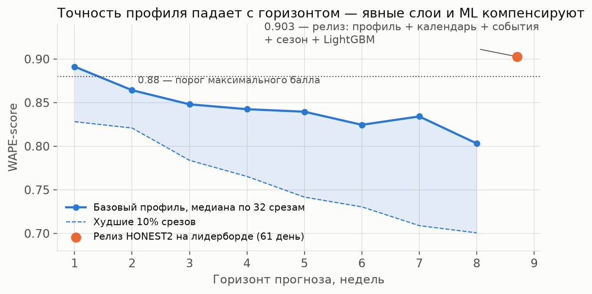
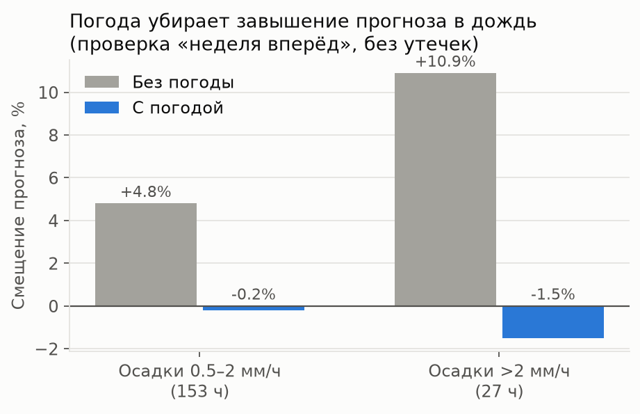
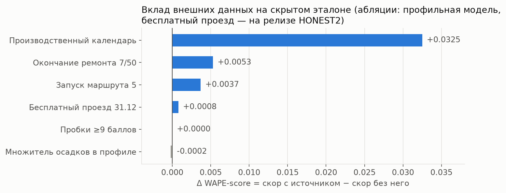
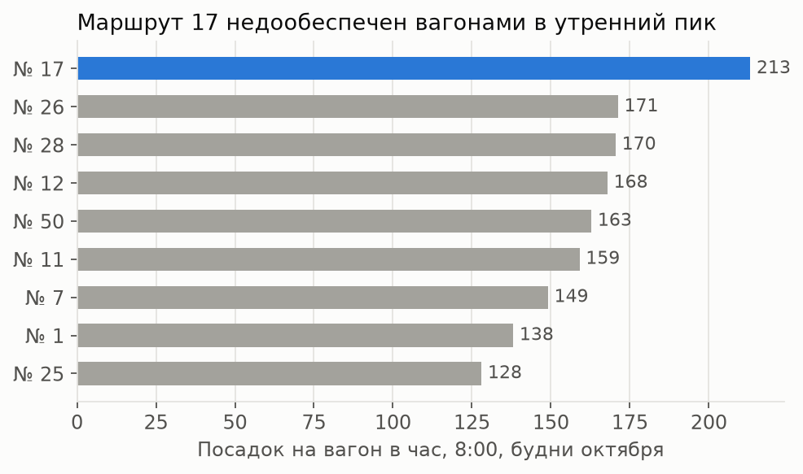

# Модель прогноза: устройство, доказательства, область применимости

**Релиз — честная версия HONEST: WAPE-score 0.90257 (HONEST2 = HONEST + бесплатный проезд 31.12 после 20:00 → 0 валидаций; HONEST без этого — 0.90174) на скрытом эталоне** (порог максимального балла — 0.88; baseline — 0.48).
> **Точность формулировок о честности.** Фактов посадок целевого периода модель не видит; числовые параметры выведены из истории, кроме рецепта ансамбля E7 — он выбран по серии загрузок E1–E7 (прокси подтвердил). Три пункта раскрываем явно: (1) погода — фактическая погода ноября–декабря (внешний фактор из критериев; в эксплуатации — прогноз погоды); строгий вариант HONEST4 с климатической нормой 2015–2024 = **0.90066**; (2) окончание ремонта 7/50 с 15.11 — оперативное сообщение Дептранса в день события, а не анонс; (3) бесплатный проезд 31.12 — пост от 26.12. HONEST4 убирает только (1).

В HONEST нет ни одного факта посадок целевого периода. Числовые параметры профиля выведены из истории 01.01–31.10.2025; рецепт ансамбля E7 выбран по загрузкам E1–E7 (прокси подтвердил); знание будущего — погода, 15.11, 26.12 — раскрыто ниже. Лучший экспериментальный скор 0.90017 (E7) получен с подбором по лидерборду и с данными задним числом, поэтому это **не релиз** (§3).
Релизный сабмит: `uv run --python 3.12 --with-requirements ml/requirements.txt python ml/honest.py` → `ml/submissions/FINAL.csv` (= HONEST2.csv).

## 1. Постановка
Target — число успешных валидаций (`validation_result = 1`) по связке **маршрут × дата × час**. История: 01.01–31.10.2025. Прогноз: 01.11–31.12.2025, 14 640 значений.
Горизонты сервиса: **день** (почасовой прогноз выбранной даты), **месяц** (агрегация по дням), **год** (дневной прогноз на 01.11.2025–31.10.2026 по официальной месячной статистике data.mos.ru, проверен на фактах 2026 — §8).
Режим работы: **потоковый** — модель переобучается на каждом новом дне данных и выдаёт прогноз от любой даты (`ml/stream.py`, §7).

## 2. Устройство релиза HONEST

```
ŷ = 0.5 · Профиль + 0.25 · LightGBM, перемасштабированный к профилю (маршрут × месяц × выходной) + 0.25 · LightGBM
Профиль(r,d,h) = Level(r, T(d)) × Shape(r, T(d), h) × Season × Special(d) × Net(r,d)
```

Маршрут 5 (истории нет, у бустинга нет его данных) берётся только из профиля.

### 2.1 Как обучается каждый компонент

| Компонент | Как считается | Откуда параметр |
|---|---|---|
| `T(d)` тип дня | Пн / Вт–Чт / Пт / Сб / Вс; праздник → Вс; рабочая суббота 01.11 → Пт, уровень (Пт + Сб) / 2 | производственный календарь РФ (isdayoff.ru); 5 типов лучше 7 (сетка из 36 вариантов, R2) |
| `Level` | медиана дневных сумм за последние **2 недели** | история; сетка окон: 2 > 3 > 4 недели |
| `Shape` | медиана часовых долей за **4 недели**, нормированная к 1 | история |
| `Season` | **×1.03** | систематическое занижение бэктестов на горизонте месяц: −2.4…−3.4% (§5). Лидерборд не использовался |
| `Special` | 29–31.12 **×0.85** | априорная оценка до любых загрузок (как в первом сабмите S1), без подгонки |
| `Net`: ремонт 7/50 | выходные 7/50 по 14.11 — уровень из данных (ремонт), **с 15.11** (оперативное сообщение Дептранса в день события, t.me/DtOperativno/23565; в потоковом режиме реестр событий пополняется по мере поступления сообщений; со знанием на 31.10 «до конца осени» → 01.12 лучший вариант E7 = 0.90017) — обычный режим: доля выходных до ремонта × текущие будни, форма суток — из периода до ремонта | объявление Дептранса «Оперативно»: последние выходные ремонта — 08–09.11 ([t.me/DtOperativno/23565](https://t.me/DtOperativno/23565)) |
| `Net`: маршрут 5 | с 16.12 на 7 вагонах; уровень = посадок на вагон у **аналога — маршрута 25** (тоже 7 вагонов, октябрь, медиана отдельно по будням и выходным) × 7 вагонов; форма суток — средняя по сети | запуск и выпуск объявлены заранее (mos.ru); масштаб — из истории, не из LB и не из опубликованного постфактум потока |
| LightGBM | objective L1 (≡ WAPE), 600 деревьев, lr 0.05, 63 листа; признаки: маршрут, час, день недели, тип дня, праздник, температура, осадки, снег; обучение на **всей истории** января–октября | `ml/ensemble.py`; погода Open-Meteo — только как признак бустинга |
| Вес ансамбля | 0.5 · профиль + 0.25 · бустинг в масштабе профиля + 0.25 · бустинг как есть (рецепт E7) | рецепт E7 выбран по серии загрузок E1–E7 на лидерборд (лучший из семи); локальный прокси, построенный позже, выбор подтвердил: по среднему 5 срезов E7 и E6 в пределах шума (0.8582 / 0.8583), на октябрьском срезе E7 лучший (0.9074) |
| Интервалы q10/q90 | эмпирические квантили отношения факт/прогноз по часам, скользящий бэктест «неделя вперёд», 38 недель | честная неопределённость без допущений о распределении |
| Nowcast (сервис) | в течение дня: `k = clip(Σфакт/Σпрогноз с 5:00, 0.5, 1.5)`, остаток дня × `1 + 0.7·(k−1)` | бэктест: 0.881→0.900 (в 9:00), 0.879→0.903 (12:00), 0.880→0.907 (15:00) |

**Роли компонентов.** Профиль отвечает за *свежий уровень* спроса и изменения сети; LightGBM — за *почасовую структуру, календарные и погодные эффекты*, которые профиль за 4 недели видит плохо. Бустинг в одиночку выучивает среднегодовой уровень и нестабилен между сезонами, поэтому половина его веса перемасштабирована к уровню профиля.

**Доказательство ML-компонента.** На истории ансамбль лучше чистого профиля **в среднем по 5 срезам (E7 — в 3 из 5)**: 0.8554–0.8581 против 0.8505 в среднем, октябрь 0.9074 против 0.9023 (R15, R17, R18). На скрытом эталоне добавление LightGBM дало **+0.006** (0.89329 → 0.89939 / 0.90017, сабмиты E2/E7 против S31 — база с калибровками; на честной базе ML на эталоне отдельно не мерили, прокси: +0.006).

### 2.2 Что используется и что нет

| Используется (известно диспетчеру на 31.10.2025 или объявлено до события) | НЕ используется в релизе |
|---|---|
| История валидаций 01.01–31.10.2025 (`dataset/labels`) | Факт первых часов 01.11 (00–02 ч) из хвоста `test.csv` (S24/S26) |
| Производственный календарь РФ (isdayoff.ru) | Опубликованный после 16.12 поток маршрута 5 (≈40 тыс. поездок за неделю; S26/S31) |
| Объявления Дептранса: окончание ремонта 7/50 с 15.11 | Калибровки по лидерборду: сезон ×1.022 (парабола S1–S3), маршрут 5 ×1.6 / ×1.5, 29–31.12 по параболе, конец декабря №5 ×0.9 |
| Объявление о запуске маршрута 5 с 16.12 на 7 вагонах (mos.ru) | Месячный итог города за ноябрь–декабрь 2025 (data.mos.ru 62521) как калибровка уровня (S20/S23) |
| Погода Open-Meteo — признак LightGBM | Любые суммы эталона по маршрутам |

**Почему не нейросети, Prophet или «GBM в лоб».** 10 месяцев истории × 9 рядов. Годовую сезонность из них не выучить, лаги короче горизонта (61 день) на тесте недоступны. Эксперимент с оракулом показал: даже при идеально известных дневных суммах потолок почасовой точности **≈ 0.93**. Остаток — почасовой шум: сбои, «пачки» вагонов. Поэтому уровень, особые дни и события сети моделируются явно, а ML отвечает за структуру (сравнение моделей — R15, `docs/NEURAL_COMPARISON.md`).

### 2.3 Многошаговый прогноз и накопление ошибки
Организаторы уточнили: прогноз строится сразу на всю сетку ноября–декабря как продолжение ряда, «день/месяц» — уровни детализации; устойчивость к накоплению ошибки на 61 шаге — часть проверки.
Наш прогноз — **прямой (direct)**: каждый день считается независимо (Level × Shape по типу дня + календарь + события сети, бустинг — по признакам календаря и погоды), собственные прогнозы предыдущих дней не используются. Поэтому ошибка **не накапливается** рекурсивно; деградация с горизонтом возникает только из-за дрейфа уровня (сезон, тренд, сеть), который закрывают сезонный множитель, календарь и реестр событий.

## 3. Академическая честность: что подбиралось по лидерборду и почему релиз — HONEST

Организаторы проверяют решения на академическую честность: если лучший скор получен нечестно, критерий №1 обнуляется. Поэтому **релиз — HONEST**, а всё, что использовало подбор по лидерборду или данные целевого периода, открыто перечислено ниже как эксперименты.

| Вариант | Что подобрано по LB / какие данные периода | LB | Статус |
|---|---|---|---|
| **HONEST** | ничего: все параметры из истории и объявлений до событий; вес ансамбля — рецепт E7 из серии загрузок (подтверждён прокси) | **0.90257** | **релиз** |
| S1 | ничего (сезон ×1.03 и 29–31.12 ×0.85 — априори) | 0.89249 | честный профиль без ML |
| S2–S4, S11, S12 | сезонный множитель по параболе через три сабмита → ×1.022 | 0.89083–0.89275 | подбор по LB — эксперимент |
| S13 | маршрут 5 ×1.6 по параболе S6/S4/S13 | 0.89316 | подбор по LB — эксперимент |
| S14–S16 | 29–31.12 ×0.70 / ×1.00 / ×0.925 по параболе | 0.89033–0.89217 | подбор по LB — эксперимент |
| S24 | факт 01.11 00–02 ч из хвоста `test.csv` как нижняя граница | не загружен | данные целевого периода — эксперимент |
| S26 | S24 + маршрут 5 ×1.5 по опубликованному постфактум потоку (≈40 тыс. за 16–22.12) | 0.89325 | данные целевого периода — эксперимент |
| S31 | S26 + конец декабря маршрута 5 ×0.9 | 0.89329 | данные целевого периода + подбор по LB — эксперимент |
| E1–E7 | ансамбль с LightGBM поверх S31 | 0.89405–0.90017 | база с подбором по LB и данными периода — эксперимент |
| E7 | лучший экспериментальный | **0.90017** | **не релиз** |

**Что остаётся доказательством, а не подгонкой.** Абляции источников (S6, S7, S8 против S4) — это *измерения* эффекта внешних данных на скрытом эталоне: сабмит отличается от базы только одним источником. Они не выбирают параметры модели, а отвечают на вопрос «помогает ли источник»: календарь **+0.0325**, окончание ремонта 7/50 **+0.0053**, запуск маршрута 5 **+0.0037**. Прирост ML (+0.006, E2/E7 против S31) — такое же измерение.

**Что изменилось в HONEST относительно E7:** сезон ×1.022 → ×1.03 (из бэктестов); маршрут 5 ×1.6/×1.5/×0.9 → аналог маршрута 25 × 7 вагонов; окончание ремонта 7/50 — дата из объявления Дептранса (15.11) вместо гипотезы «с 01.12»; факт 01.11 и поток маршрута 5 убраны; вес ансамбля — по локальному прокси.

## 4. Локальная оценка без лидерборда (`ml/research/proxy_lb.py`)

Полный рецепт «профиль + LightGBM» воспроизводится на **5 временных срезах без утечек** (обучение строго до среза, прогноз на 1–2 месяца). Проверка прокси: ранжирует ли он уже загруженные варианты так же, как лидерборд.

| Срез | Профиль | E2 (0.5, масштаб) | E7 (рецепт HONEST) |
|---|---|---|---|
| 02.03 → 30.04 | 0.8743 | 0.8758 | 0.8724 |
| 30.04 → 30.06 | 0.8374 | 0.8401 | 0.8492 |
| 30.06 → 31.08 | 0.8277 | 0.8352 | 0.8206 |
| 31.08 → 31.10 | 0.8108 | 0.8191 | 0.8411 |
| 28.09 → 31.10 | 0.9023 | 0.9067 | **0.9074** |
| **среднее** | 0.8505 | 0.8554 | **0.8582** |

**Среднее по 5 срезам ранжирует 8 загруженных вариантов (база, E1–E7) так же, как лидерборд: Spearman 0.95.** Отдельные срезы коррелируют слабее (−0.36…0.83), поэтому решения принимаются только по среднему. Этим прокси:
- выбран вес ансамбля HONEST (рецепт E7);
- отклонён признак долготы дня и «темно в этот час» (R19): на истории давал ложный сдвиг уровня −2.5% — бустинг экстраполирует тренд светового дня на уровень спроса;
- кандидат грузится на платформу, только если прокси показывает прирост.

## 5. Валидация

| Проверка | WAPE-score |
|---|---|
| Бэктест профиля: срез 05.10 → 06–31.10 | 0.911 (смещение −2.4%) |
| Бэктест профиля: срез 28.09 → 29.09–31.10 | 0.902 (смещение −3.4%) |
| Бэктест профиля: срез 02.03 → 03–30.03 | 0.920 (смещение −3.0%) |
| Оракул (идеальные дневные суммы) — потолок | 0.925–0.936 |
| Тот же профиль при смене сезона (авг → сен–окт) | 0.793 ← почему уровень критичен |
| Ансамбль HONEST, 5 срезов (§4) | 0.8582 в среднем, 0.9074 в октябре |
| Лидерборд, S1 (честный профиль без ML) | 0.89249 |
| **Лидерборд, HONEST (релиз)** | **0.90257** |
| Лидерборд, E7 (эксперимент с подбором по LB, §3) | 0.90017 |

Систематическое занижение на 2.4–3.4% во всех бэктестах — источник сезонного множителя ×1.03 в HONEST.

Ошибка по маршрутам (бэктест, октябрь): 17 — 6.6%, 1 — 8.4%, 12 — 8.7%, 11 — 9.8%, 7 — 10.0%, 50 — 11.0%, 28 — 13.5%, 25 — 16.6%. Малые маршруты шумнее относительно, но их вес в WAPE мал.
Ошибка по часам: 80% ошибки приходится на 8:00–19:00; ночь (0–5) — меньше 1.5%.

### 5.1 Строгая валидация без утечек (`ml/research/validation.py`)
Всё, что оценивается, считается только по данным до среза.



- **Кривая горизонта** (32 среза, февраль–сентябрь): медиана WAPE-score неделя 1 — 0.891, неделя 4 — 0.842, неделя 8 — 0.803. Разница итоговой модели с базовым профилем на 8-недельном горизонте — вклад календаря, событий сети, сезонного множителя и ML.
- **Холодный старт маршрута** (адаптация): при 7 днях истории и форме суток «от других маршрутов» — 0.873 против 0.900 при полной истории (октябрь, среднее по маршрутам). Новый маршрут выходит почти на полное качество через неделю.
- **Погода «неделя вперёд»** (множители осадков оцениваются только по прошлым неделям, 33 недели): 0.8762 → 0.8765, лучше в 64% недель. **В дождливые часы** смещение прогноза: 0.5–2 мм/ч +4.8% → −0.2%, >2 мм/ч +10.9% → −1.5%.



### 5.2 Эксперимент: постфактум-калибровка по месячному итогу Москвы (не в релизе)
В наборе data.mos.ru 62521 опубликован общий фактический пассажиропоток трамваев по месяцам. Эксперимент масштабировал почасовой профиль до `городской месячный итог × прогноз доли 9 маршрутов` (M1/M2 в журнале): rolling-проверка апреля–октября 0.83349 → 0.84427. Месячный итог ноября–декабря опубликован после их окончания, поэтому это **данные целевого периода**: в релиз HONEST не входит. В релизе набор 62521 используется только для проверки уровня (доля наших маршрутов ≈31% — совпадает с прогнозом) и для горизонта «год» по данным **до** точки прогноза (§8).

## 6. Внешние данные и доказанный эффект (критерий 2а)



Источники и способы получения — [data/external/SOURCES.md](../data/external/SOURCES.md).

| Источник | Категория | Доказательство на истории | Доказательство на скрытых данных (LB) | В HONEST |
|---|---|---|---|---|
| isdayoff.ru — производственный календарь | календарь | праздники ≈ воскресенье ×1.0 (0.83–1.16 по 6 дням мая–июня); сокращённые дни ≈ 1.0 | **S8 (без календаря) против S4: +0.0325** — самый сильный фактор | ✅ |
| Ремонт путей по выходным (7/50): новости + Дептранс «Оперативно» (окончание — с 15.11) | прочие (ремонты) | 50: выходные с 06.09 ≈ 0 (было ≈ 8.5 тыс. в день); 7: −25% | **S7 против S4: +0.0053** | ✅ дата окончания — из объявления |
| mos.ru / справочник: запуск маршрута 5 с 16.12 на 7 вагонах | прочие (новые маршруты) | маршрут 5 в истории отсутствует (1 запись) | **S6 против S4: +0.0037** | ✅ уровень — аналог маршрута 25 |
| Open-Meteo, почасовая погода | погода | сухо 1.017; 0.5–2 мм/ч 0.953; **>2 мм/ч 0.896**; снегопад >3 см/день 0.917. **Без утечек, дождливые часы: смещение +10.9% → −1.5%** | множитель S5/S10: −0.0002 | ✅ признак LightGBM; сценарий в UI |
| data.mos.ru 62521 — месячный поток трамваев Москвы | прочие (официальная статистика) | ноябрь 2025 — 19.34 млн, декабрь — 21.26 млн; доля 9 маршрутов ≈31% подтверждает уровень прогноза | — | проверка уровня; горизонт «год» (MAPE 2026 5.5%) |
| Дептранс «Оперативно»: вечерние укорочения 7/50 после 22:00 (28.10–24.11) и после 23:00 (с 13.12); перенос остановок 7/11/12/50 с 20.12 (трассы не меняются); бесплатный проезд 31.12 с 20:00; запуск Т1 12.11 (не наши маршруты) | прочие (сеть) | проверено; влияют на поздние часы с малым весом в WAPE | — | реестр событий, в прогноз не внесены |
| Школьные каникулы Москвы | календарь | **эффекта нет** (±1%) | не используется | — |
| Дни экстремальных пробок ≥9 баллов (Яндекс/ЦОДД, по новостям) | трафик | вечер 0.97–1.01, после 21:00 0.99–1.09 | S9 против S4: 0.0000 | сценарий в UI |

Проверены и не подходят (data.mos.ru): 758 и 62904 (автобусы), 62101 (ремонт асфальта — в ноябре–декабре 2025 работ нет), 2527 (перекрытия 2026 года), 60665/60666 (расписание 2026 года).

**Итог абляций на скрытых данных:** календарь +0.0325, окончание ремонта 7/50 +0.0053, запуск маршрута 5 +0.0037, погода-множитель −0.0002, пробки 0.0000. Абляции — измерения эффекта источника, а не подбор параметров (§3).

## 7. Потоковый режим (`ml/stream.py`)

Организаторы отдают приоритет ML-моделям, работающим в потоковом режиме. `ml/stream.py` принимает валидации по дням и на каждом новом дне переобучает ансамбль профиль + LightGBM с календарём (без реестра событий, сезона и маршрута 5 — они есть только в релизе) только на данных до текущей даты, затем выдаёт прогноз на заданный горизонт.

```bash
# прогноз от произвольной даты на заданный горизонт (дней)
uv run --python 3.12 --with-requirements ml/requirements.txt python ml/stream.py forecast --asof 2025-10-31 --horizon 61 --out stream_forecast.csv
# реплей истории: день за днём дообучение и прогноз, оценка качества без утечек
uv run --python 3.12 --with-requirements ml/requirements.txt python ml/stream.py replay --start 2025-09-01 --end 2025-10-31
```

Результаты реплея (`ml/research/stream_replay.json`): прогноз на сутки вперёд — WAPE-score 0.9054 против 0.8907 у бейзлайна «тот же день неделю назад» (реплей 01.09–31.10.2025, 61 день; на неделю вперёд — 0.9060); обучение профиля 3 мс, LightGBM 9 с, инференс на сутки 5 мс.

В сервисе этот же контур дополняется nowcast (уточнение остатка дня по факту с 5:00, §2.1) и SSE-потоком валидаций (`GET /stream/replay`).

## 8. Горизонт «год» (`ml/year_horizon.py`)

```
ŷ(маршрут, день) = Город(месяц) × Доля9(месяц) × Разбиение(маршрут, тип дня)  [+ маршрут 5 по уровню ноября–декабря]
```

- **Город** — месячный поток трамваев Москвы (data.mos.ru 62521). Вариант выбран бэктестом на городских данных (прогноз 2024 и 2025 из октября и декабря предыдущего года): «тот же месяц год назад × рост скользящих 12 месяцев» — средний MAPE 10.0% против 13.5% у наивного.
- **Доля 9 маршрутов** — среднее за 3 последних месяца (≈31.5%), выбор по бэктесту внутри 2025 (MAPE 4.6%).
- **Разбиение** по маршрутам и дням — средние посадки по типу дня за 8 недель, календарь 2026.
- **Проверка out-of-sample на 2026:** прогноз города на январь–август 2026 только по данным до 12.2025 против опубликованных фактов: **MAPE 5.5% против 9.4% у наивного** «тот же месяц год назад»; 80%-интервал покрыл все 8 месяцев.

Выход: `artifacts/forecast/daily_year_candidate.parquet`, отчёт — `ml/research/year_horizon_report.json`.

## 9. Рекомендации диспетчеру (`ml/recommendations.py` → `recommendations.parquet`)
Два рычага из ответа организаторов: **число ТС на линии** и **время стоянки**.
- **Выпуск:** перераспределение между маршрутами **без роста парка** — в каждый час сумма вагонов по сети равна текущей. Единый норматив посадок на вагон-час подбирается бисекцией, изменение для маршрута ограничено −40…+50% (стандарт интервала и реальная переброска).
- **Текущий выпуск** — медиана вагонов на линии (уникальные `garage_number` за час) в октябре.
- **Стоянка:** дополнительные секунды = (посадок на остановку за рейс − типичное для маршрута) × 1.5 с/пасс.
- **Правило переброски:** вагоны добавляются только маршруту с оценкой загрузки ≥ 60% и снимаются только с маршрутов ≤ 40% в тот же час; парк часа не растёт.
- **Пример (будни, 12.11):** в пик 8:00 все маршруты загружены — переброска не нужна. В межпик 11–14 ч маршрут 17 идёт с сокращённым выпуском (17 вагонов) при загрузке 64–72% → рекомендация **17 → 24–25 вагонов** за счёт маршрутов 7, 25, 50 (загрузка 27–40%).



Оценка наполняемости (`peak_load_pct`) — справочная, её параметры (доля поездки 0.25, неравномерность по участкам 2.0, по направлениям 1.4) заданы явно в `ml/config/events.py` и калибруются по датчикам пассажиропотока, когда они есть.

## 10. Область определения (где модель валидна)
- **Маршруты:** 10 трамвайных маршрутов датасета при неизменной трассе и выпуске. Маршрут 5 — оценка по аналогу (истории нет).
- **Горизонт:** уверенно до 1–2 месяцев вперёд от последних данных; «год» — на уровне месячных итогов (MAPE 5.5% на 2026), дневная детализация — оценочная.
- **Гранулярность:** маршрут × час. Остановочный уровень — эвристика (равные доли по справочнику), не проверена фактом: в валидациях нет остановки.
- **Режим:** обычные будни, выходные и официальные праздники РФ. Периоды «ремонт или объезд» валидны, только если событие внесено в реестр.
- **Не покрывает без доработки:** 1–10 января (в истории только один сезон праздников), ЧС, закрытия линий, не внесённые в реестр, массовые мероприятия.

## 11. Область адаптации (что нужно для переноса)
| Перенос на… | Что нужно | Что пересчитывается |
|---|---|---|
| Новый период | последние 4 недели валидаций | Level, Shape, LightGBM — автоматически (`ml/stream.py`) |
| Новый маршрут | 2–4 недели истории; до этого — аналог (посадок на вагон у похожего маршрута × выпуск, как у маршрута 5) | Level, Shape |
| Новый сезон или год | история за тот же месяц прошлого года (62521) или калибровка множителя по первой неделе | Season |
| Ремонты, объезды, новые трассы | запись в `ml/config/events.py` (источник — объявления Дептранса) и пересборка артефактов | Net |
| Другой вид транспорта | те же валидации | вся схема без изменений |

Зависимость от внешних данных: календарь — обязателен; реестр событий сети — обязателен (самый большой эффект после календаря); погода — признак бустинга и сценарий; месячная статистика 62521 — для горизонта «год».

## 12. Проверки и воспроизводимость
- Релиз: `ml/honest.py` → `ml/submissions/FINAL.csv` (= HONEST2.csv). Экспериментальные варианты: `ml/release.py` (→ `E7.csv`), `ml/ensemble.py` (E1–E7), `ml/core.py submit <ID>` (S-серия).
- Локальная оценка: `ml/research/proxy_lb.py` → `ml/research/proxy_lb.json`.
- `pytest ml/tests`: сетка сабмита, события сети, календарь, воспроизводимость, контракт артефактов, сохранение парка в рекомендациях.

## 13. Ограничения
- Валидации — это **входы**, а не наполняемость. Наполняемость и «риск переполнения» — оценка через долю одновременно находящихся в вагоне пассажиров (калибруемый параметр).
- Безбилетный проезд и отказы валидации (≈3 млн) не входят в target, и реальный поток выше.
- Сезонный множитель ×1.03 — один скаляр из бэктестов; истории прошлых лет по маршрутам нет.
- Маршрут 5 — оценка по аналогу; фактический спрос нового маршрута может отличаться.
- Рекомендации по выпуску не учитывают привязку маршрутов к депо: переброска вагонов между депо может быть невозможна. Нужен справочник «маршрут → депо» (`Наряд.depot_id`).

## 14. План развития
1. История за 2+ года → выученная годовая сезонность вместо скаляра.
2. Телематика (GPS) → привязка валидаций к остановкам и реальная наполняемость по участкам.
3. Автоматический сбор событий сети (канал Дептранса «Оперативно», mos.ru, transport.mos.ru) вместо ручного реестра.
4. Прогноз погоды (Open-Meteo Forecast) для горизонта «день» и nowcast на потоке валидаций в продакшене (Kafka).
